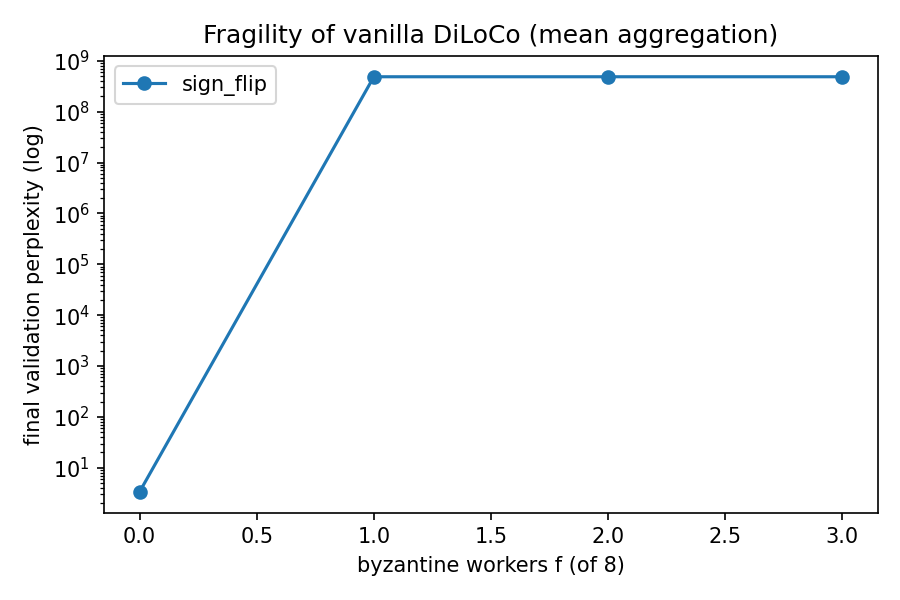
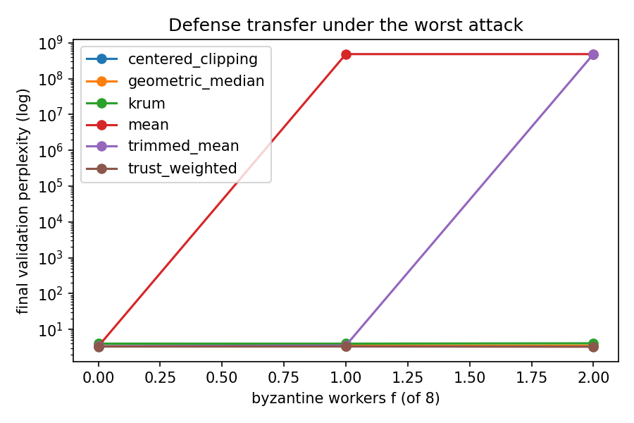
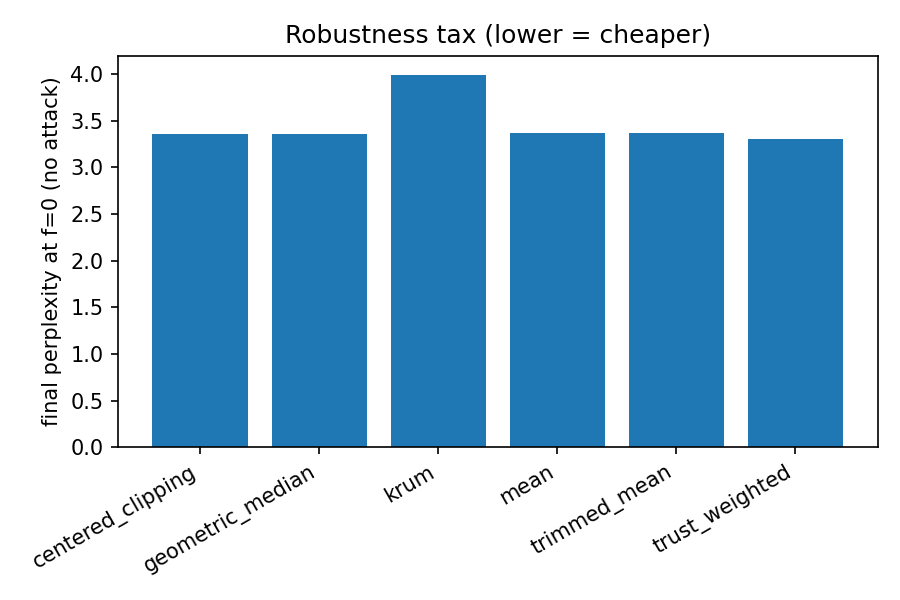

# RoDiLoCo — Robust DiLoCo

**Byzantine-robust low-communication distributed training.**

 

Low-communication training methods such as [DiLoCo](https://arxiv.org/abs/2311.08105)
promise *cross-organisation*, *over-the-internet* pretraining: independent parties jointly
train one model while exchanging pseudo-gradients only every `H` steps, matching synchronous
quality at ~100× less communication. Yet that literature assumes **honest workers** — the
exact assumption the cross-organisation setting violates. A single corrupted worker at the
outer aggregation step can destroy an entire pretraining run.

RoDiLoCo studies that gap empirically: **how fragile is vanilla DiLoCo, do classical
Byzantine-robust aggregators transfer to its outer-momentum / pseudo-gradient / few-worker
regime, at what cost — and can we do better?** The one-line framing:

> Prior work makes DiLoCo *resilient* (to crash faults). No one had made it *robust* (to
> adversaries). Fault-tolerance ≠ Byzantine-tolerance.

## Key results

On a ~1.8M-parameter char-level Transformer (`d_model=192`, 4 layers) trained on a TinyStories
subset with 8 simulated workers, `H=50` inner AdamW steps, 15 outer Nesterov rounds, under a
sign-flip attack (λ=10; single seed, reduced scale, fp16 on one T4):

- **Vanilla DiLoCo is catastrophically fragile.** One malicious worker out of eight
  (`f=1/8`) sends the final perplexity from **3.4 → diverged**.
- **Classical defenses transfer — partially.** Krum, geometric median and centered clipping
  hold; coordinate-wise trimmed mean fails once the byzantine count exceeds its trim
  parameter; Krum pays the largest "robustness tax".
- **Our trust-weighted outer optimizer wins on both axes** — it is simultaneously the
  *cheapest* defense (lowest perplexity with no attack) and the *most robust* (flattest under
  attack).

| aggregator | f=0 (tax) | f=1 | f=2 |
|---|---|---|---|
| mean (vanilla DiLoCo) | 3.37 | diverged | diverged |
| trimmed mean | 3.37 | 3.53 | diverged |
| Krum | 3.99 | 3.98 | 4.08 |
| geometric median | 3.35 | 3.45 | 3.52 |
| centered clipping | 3.36 | 3.44 | 3.39 |
| **trust-weighted (ours)** | **3.30** | **3.33** | **3.27** |

*"diverged" = perplexity hit the `exp(20)` cap. The `f=2 < f=0` gap for trust-weighted is
within seed noise — the honest claim is "flat under attack", not "improves".*

<p align="center">
  
  
  
</p>

Positioning vs prior work: [docs/related_work.md](docs/related_work.md).
Write-up: [paper/rodiloco.tex](paper/rodiloco.tex).

## Method

The whole project fits behind one interface:

```python
def aggregate(deltas: list[Tensor]) -> Tensor: ...
```

Every aggregator implements it. Attacks are wrappers that corrupt a byzantine subset of the
`deltas` *before* aggregation.

**Simulation.** The `n` workers are simulated **sequentially on one GPU**: for each worker `k`
we load the global parameters, run `H` inner AdamW steps on its data shard, and store the
pseudo-gradient `Δ_k = θ_before − θ_after`. The `Δ`s are aggregated and the outer Nesterov
step is taken. No cluster is required; communication is measured *analytically* (the bytes
that would be exchanged), never physically transmitted.

**Aggregators.**
- *Baseline* — `mean` (vanilla DiLoCo).
- *Classical robust* — coordinate-wise `trimmed_mean`, `krum` / Multi-Krum,
  `geometric_median`, and `centered_clipping` (a modern, momentum-aware defense whose running
  center coincides with the outer Nesterov momentum).
- *Contribution* — `trust_weighted`: score each worker by the EMA cosine similarity of its
  `Δ_k` to the previous robust aggregate, then aggregate with `softmax(score/τ)` weights.
  Unlike Krum it *weights* rather than *excludes* (no information is discarded) and it exploits
  the temporal structure the outer setting makes informative. Two design choices make it hold
  under strong attacks: a robust (geometric-median) cold-start so the trust signal is never
  seeded from a poisoned round-0 mean, and a **median**-norm rescale so a norm-inflating
  attacker cannot blow up the aggregate.

**Attacks.** Blind — `sign_flip`, `scaled_noise`, `targeted_drift` (inner label poisoning).
Omniscient/adaptive — `alie` and `min_max`, which read the honest updates and craft a
colluding vector inside the honest cloud to evade distance-based defenses.

## Repository layout

```
src/rodiloco/
  model.py         from-scratch decoder Transformer (RMSNorm, RoPE, causal MHA, SwiGLU)
  optim.py         from-scratch AdamW (_foreach-batched) + cosine-warmup + grad clipping
  data.py          token dataset, i.i.d. / non-i.i.d. worker sharding
  train.py         single-worker training loop (mixed precision)
  diloco.py        DiLoCo sequential simulation + outer Nesterov + synchronous baseline
  aggregators.py   mean / trimmed_mean / krum / geometric_median / centered_clipping / trust_weighted
  attacks.py       sign_flip / scaled_noise / targeted_drift / alie / min_max
  generate.py      autoregressive sampling
  utils.py         seeding, config, mixed-precision, param<->vector, comm accounting
configs/           YAML experiment configs (a run == a config + a seed)
scripts/           reproduce_*.sh, plot_results.py, prepare_data.py, ablate_trust.py
notebooks/         rodiloco_kaggle.ipynb — one-click reproduction on a free T4
paper/             rodiloco.tex — arXiv-style write-up
tests/             27 unit + integration tests
docs/              related work / novelty positioning, research journal
```

## Installation

```bash
uv sync                     # or: pip install -e ".[dev,data,plot]"
pytest                      # 27 tests, CPU, seconds
```

Requires Python 3.11+ and PyTorch 2.2+.

## Reproducing the results

**One-click (free GPU).** Open [`notebooks/rodiloco_kaggle.ipynb`](notebooks/rodiloco_kaggle.ipynb)
on Kaggle or Colab (GPU T4), set `REPO_URL`, and **Run All** — it clones, checks the GPU and
data, runs the full campaign (~45 min) and renders the three plots. The notebook asserts on a
missing GPU or dataset, so it cannot silently run on CPU or a toy corpus.

**Locally / on your own GPU.**

```bash
python scripts/prepare_data.py --out data/tinystories_train.txt --max-chars 8000000
bash scripts/reproduce_phase2_baseline.sh    # DiLoCo vs synchronous (comm plot)
bash scripts/reproduce_phase3_attacks.sh     # fragility grid  (plot #1)
bash scripts/reproduce_phase4_defenses.sh    # defense campaign (plots #2, #3)
python scripts/ablate_trust.py --config configs/defense_trustweighted.yaml
```

Every run writes a `history.json` stamped with its seed, config and git commit — *a
non-reproducible result does not exist*.

**Building the paper.** `cd paper && latexmk -pdf rodiloco.tex` (or `pdflatex` → `bibtex` →
`pdflatex` ×2). Figures are pulled from `results/*.png` automatically; if a plot is missing,
a labelled placeholder is rendered instead, so the paper always compiles.

## Limitations

The study is deliberately small: a ~1.8M-parameter model, workers **simulated** rather than
physically distributed, i.i.d. shards, a single seed for the headline table, and one attack
family (sign-flip) in the main comparison. [Scaling laws for
DiLoCo](https://arxiv.org/abs/2503.09799) suggest which conclusions should carry to larger
scale, but we do not verify this directly. Natural extensions: seed replication (mean±std),
the omniscient `min_max` attack as the main stressor, the asynchronous / Decoupled setting,
non-i.i.d. data, and convergence guarantees under attack.

## Citation

```bibtex
@misc{rodiloco2026,
  title  = {RoDiLoCo: Byzantine-Robust Low-Communication Distributed Training},
  author = {Benkiran, Taha},
  year   = {2026},
  note   = {https://github.com/MTahaB/RoDiLoCo}
}
```

## License

MIT — see [LICENSE](LICENSE).
